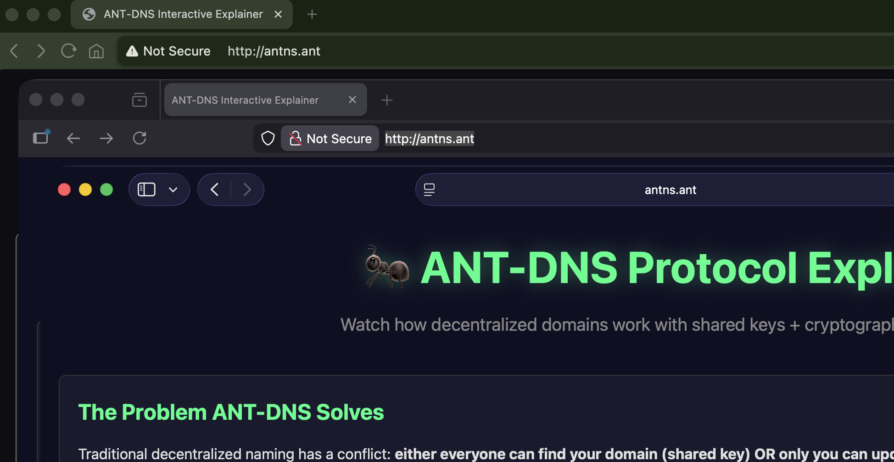

# AntNS - Autonomi Name System

A decentralized domain name system for the Autonomi network that provides human-readable `.ant` domain names with cryptographic ownership verification.



## What is AntNS?

AntNS solves the fundamental conflict in decentralized naming systems between **discoverability** (everyone can find your domain) and **ownership** (only you can update it).

We use a hybrid approach:
- **Shared register key** → Universal discoverability (everyone derives the same address for `mydomain.ant`)
- **Ed25519 signatures** → Cryptographic ownership (only the key holder can create valid entries)
- **Spam filtering** → Invalid entries are ignored during lookup

## How It Works

### Registry Structure

When you register `mydomain.ant`, a register is created using a shared DNS key that everyone knows. This means anyone can find it at the same address, and anyone can write to it - but only signed entries from the domain owner are considered valid.

**Example Register for `mydomain.ant`:**

```
Register: mydomain.ant (deterministic address via shared key)
├─ Entry 1: { "publicKey": "98daa2aba6513e5c..." } ← Owner document
├─ Entry 2: { "records": [...], "signature": "valid_sig_abc" } ✅ Valid
├─ Entry 3: { "records": [...], "signature": "spam_sig_xyz" } ❌ Invalid (ignored)
└─ Entry 4: { "records": [...], "signature": "valid_sig_def" } ✅ Valid
```

**Lookup behavior:**
1. Download entry 1 to get the owner's public key
2. Process entries 2+ in order
3. Verify each signature against the owner's public key
4. Skip invalid signatures (spam)
5. Return the last valid entry

**Why this works:**
- ✅ Anyone can find your domain (shared key = deterministic address)
- ✅ Only you can update it (Ed25519 signature verification)
- ✅ Spam is filtered client-side (invalid signatures ignored)
- ✅ No central authority needed

## Quick Start

### Install

```bash
# Build and install globally
cargo install --path .
```

### Setup Wallet

Antns shares wallets from the ant cli. You can use the ant cli tool to create one if you don't have one.

```bash
# Create wallet using ant CLI
ant wallet create
```

### Register a Domain

```bash
antns names register mydomain.ant
# → Prompts for wallet selection
# → Pays for registration
# → Domain key saved locally
```

### List Your Domains

```bash
antns names list
```

### Lookup a Domain

```bash
antns names lookup mydomain.ant
```

### Start DNS/HTTP Server

```bash
antns server start
```

This starts both a DNS server (port 53) and HTTP server (port 80) that resolve `.ant` domains with caching support.

### Manage Domain Records

```bash
# List records for a domain
antns records --name mydomain.ant list

# Add a record
antns records --name mydomain.ant add ANT . <chunk-address>
antns records --name mydomain.ant add TEXT www "Hello World"

# Update a record by index
antns records --name mydomain.ant update 0 ANT . <new-chunk-address>

# Delete a record by index
antns records --name mydomain.ant delete 0
```

### Backup Domain Keys

```bash
# Backup to Autonomi network vault
antns keys backup

# Restore from vault
antns keys restore

# Check backup status
antns keys status
```

## Storage Locations

AntNS stores keys in platform-specific directories:

**Platform base paths:**
- **Linux**: `~/.local/share/autonomi/`
- **macOS**: `~/Library/Application Support/autonomi/`
- **Windows**: `C:\Users\<user>\AppData\Local\autonomi\`

### Wallet Keys
```
<base-path>/client/wallets/
```
These are shared with the `ant` CLI tool. Wallets can be plain text or encrypted (`.encrypted` extension).

### Domain Keys
```
<base-path>/client/user_data/domain-keys/
```
Domain-specific Ed25519 keypairs are stored as `domain-key-<domain-name>.txt` files.

**Important:** Back up these directories or use `antns keys backup` to store domain keys on the Autonomi network.

## Project Status

- **Phase 1**: ✅ Core functionality implemented
- **Phase 2-3**: ✅ Payment integration complete (ant CLI wallet support)
- **Phase 4**: ✅ DNS/HTTP servers with caching implemented
- **Phase 5**: ✅ Network vault backup/restore implemented

## Documentation

- [RFC-ANT-DNS.md](RFC-ANT-DNS.md) - Formal protocol specification
- [ARCHITECTURE.md](ARCHITECTURE.md) - System architecture and design
- [CONTRIBUTING.md](CONTRIBUTING.md) - Development guide and Rust implementation details

## License

GPL-3.0
